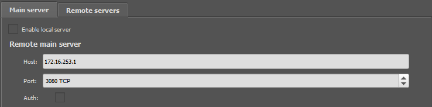

# Terraform GCE GNS3 Module

Terraform module which provisions a [GNS3](https://www.gns3.com/) remote server on a Ubuntu 18.04 Google Compute Instance, using [Terraform](https://www.terraform.io/) and [Packer](https://www.packer.io/). GNS3 is a network software emulator that simulates complex network configurations virtually. This module is based on GNS3's official [instructions](https://docs.gns3.com/docs/getting-started/installation/remote-server/) on how to set up a remote server, but automated and with additional features.

The basic GNS3 remote server setup involves:

* Setting up OpenVPN to avoid exposing GNS3 to the internet

* GNS3 running on the server reachable by connecting via OpenVPN

* OpenVPN client profile available for download from a server endpoint for ease of sharing

Since this module is mainly geared towards development and training purposes, it does not focus on configuring a security hardened server, and instead, focuses on ease of setup and minimizing costs.

## Why run a GNS3 remote server

* Better performance with dedicated vCPUs for more complex workloads

* Can collaborate on projects with others/share the instance between several users

* No need to keep large image files, VM images, and VM software on your personal computer

## Features

* Automated deployment of GNS3 remote server on a Google Compute Instance along with firewall settings

* Save images, appliances and project files to a persistent disk

* Ability to shutdown server when not in use to minimize costs

* Protect VPN profile endpoint via username and password authentication

## Quickstart Requirements

* Terraform version 0.13 or higher. Download Terraform [here](https://www.terraform.io/downloads.html)

* Google Cloud Account and `gcloud` CLI installed.

* An OpenVPN client

## Quickstart

1. Create a Google Cloud Project.

    ```bash
    gcloud projects create <PROJECT_ID>
    gcloud config set project <PROJECT_ID>
    ```

2. Enable the Compute Engine API (may need to first enable billing for the project).

    ```bash
    gcloud services enable compute.googleapis.com
    ```

3. Create a [service account key](https://cloud.google.com/iam/docs/creating-managing-service-account-keys#prerequisites_for_this_guide) for one of the service accounts in your project (can be the default or a dedicated service account for Terraform). Ensure that the service account has at least the following roles: `roles/compute.instanceAdmin.v1`, `roles/compute.securityAdmin`.

    ```bash
    gcloud iam service-accounts keys create <KEY_OUTPUT_PATH> --iam-account <SERVICE_ACCOUNT_EMAIL>
    # To bind service account role
    gcloud projects add-iam-policy-binding <PROJECT_ID> --member=serviceAccount:<SERVICE_ACCOUNT_EMAIL> --role=<ROLE_NAME>
    ```

4. Create a `main.tf` file in your project directory with the following contents:

    ```python
    provider "google" {
      version     = "~> 3.0"
      credentials = file("path/to/service-account-key.json")
      project     = "my_gcp_project"
      zone        = "my_gcp_zone"
    }

    module "gns3_server" {
      source = "github.com/weiijiie/terraform-gce-gns3"
  
      # Selected machine type, either the E2 or N2 high-CPU machine types
      # are recommended, with 4-8 virtual CPUs based on workload requirements
      machine_type = "e2-highcpu-8"
  
      # Disk size in GB for persistent disk. Adjust according to size requirements
      # of GNS3 image and project files
      gns3_disk_size = 20
  
      # GNS requires that the server version matches the client version, thus I
      # publish the latest 4 versions of the GNS3 server as pre-built base images
      # for convenience. For long-term stability it is recommended to build your own
      # base images using the provided Packer files
      image_family  = "gns3-server-v2-2-15"
      image_project = "civic-circuit-287709" # Project containing the image
  
      # Allow your IP to access the server
      allow_ingress_from_current_ip = true
    }

    output "openvpn_profile_endpoint" {
      description = "Endpoint to download the OpenVPN profile from."
      value       = module.gns3_server.openvpn_profile_endpoint
    }

    output "gns3_server_ip" {
      description = "Private IP that the GNS3 server will listen for connections on. Set the remote server host to this value in the GNS3 client UI."
      value       = module.gns3_server.gns3_server_ip
    }

    output "gns3_server_port" {
      description = "Port used to connect to the GNS3 server. Set the remote server port to this value in the GNS3 client UI."
      value       = module.gns3_server.gns3_server_port
    }
    ```

5. Run `terraform apply`, inspect the generated plan, and confirm.

6. Download the OpenVPN client profile from the endpoint specified in the Terraform output (may need to wait a short while for the server to be ready to accept connections), and use it to connect to the VPN via your OpenVPN client.

7. Open the GNS3 client and specify the host and port under Edit > Preferences > Server, based on the IP and port specified in the Terraform output. GNS should be able to connect to the remote server.

    

8. Done!

## Resources Created

* 1x Google Compute Instance, the GNS3 server

* 1x Google Compute Disk of type "pd-standard"

* 1x Google Compute Firewall which allows SSH access and access to the OpenVPN client profile download endpoint and OpenVPN port

## GNS3 Server base image

The base image that the Google Compute Instance is booted from is created using [Packer](https://www.packer.io/), with the Packer files available in the `packer/` directory. Since the GNS3 client can only connect to the server if they are running the same version, I publish the latest 4 released versions of the GNS3 server for convenience sake. The images are available in the project `civic-circuit-287709` with the image family of `gns3-server-v<MAJOR_NUMBER>-<MINOR_NUMBER>-<PATCH_NUMBER>` (dashes separating the numbers). However, it is recommended to build your own base images using Packer for stability and reliability.

To build the base images using Packer:

1. Clone the repository using `git`

2. cd into the `packer/` directory

3. Ensure Packer can authenticate with Google Cloud services by following the instructions [here](https://www.packer.io/docs/builders/googlecompute.html).

4. Run the following command to build your GNS3 server image in your project (dots separating the version numbers):

    ```bash
    packer build -var "gcp_project_id=<GCP_PROJECT_ID>" -var "gcp_zone=<GCP_ZONE>" -var "gns3_version=v<MAJOR_NUMBER>.<MINOR_NUMBER>.<PATCH_NUMBER>" gns3.json
    ```

## Details

### Costs

The costs of running the GNS3 server depends on the machine type of the Google Compute instance, but if using E2/N2 high-CPU types with 4-8 vCPUs, the price is generally under $0.50 USD per hour (these types are recommended solely based on empirical observation, there may be better machine types more suited to running your workloads). In addition, the persistent disk used to store the GNS3 files may incur a small monthly cost, depending on how large the files are.

### Shutting down the instance

To save costs, if the instance is not required to be running 24/7, the instance can be shut down and rebooted safely. To do so, set the `enable-server` variable to be `false` in the module body and run `terraform apply`. Note that when Google Compute instances are rebooted, they may not keep the same public IP address. Hence, you will likely have to re-download the OpenVPN client profile and connect with the new profile.

### Ingress

By default, the module only allows traffic from your current public IP to the server. If you want other parties to be able to share the server, allow other IPs access to the server by setting the `allowed_ingress_cidr_blocks` Terraform variable.

### Protecting OpenVPN client profile endpoint

By default the OpenVPN client profile endpoint is not protected, and any IP address that the firewall allows through can download the OpenVPN client profile and connect to the VPN. Due its ephemeral nature and the lack of sensitive data on the server, this may not be a huge problem. However, if necessary, the OpenVPN client profile endpoint can be configured to have basic username/password HTTP authentication. To do so, add the following to the module body and re-run `terraform apply` (note that the instance will have to be re-created).

```bash
openvpn_profile_endpoint_creds = {
    username = "my_username"
    password = "my_password" # change to something secure
}
```

## Terraform Requirements

| Name | Version |
|------|---------|
| terraform | >= 0.13.0 |
| google | ~> 3.0 |
| http | ~> 1.2.0 |

## Terraform Providers

| Name | Version |
|------|---------|
| google | ~> 3.0 |
| http | ~> 1.2.0 |

## Inputs

| Name | Description | Type | Default | Required |
|------|-------------|------|---------|:--------:|
| allow\_ingress\_from\_current\_ip | When enabled, the Google Compute Instance will allow inbound connections from your current IP address. Should consider disabling if your IP address is expected to not be stable. | `bool` | `true` | no |
| allowed\_ingress\_cidr\_blocks | Additional list of CIDR blocks that the Google Compute Instance will allow inbound connections from. Can be used to enable connections when `ingress_from_current_ip_only` is disabled. | `list(string)` | `[]` | no |
| enable\_server | If true, sets the Google Compute Instance to a running state. Otherwise, stops the instance. | `bool` | `true` | no |
| gns3\_disk\_size | Size (in GB) for the persistent disk used to store GNS3 files (images, appliances etc.) | `number` | n/a | yes |
| gns3\_server\_ip | Private IP that the GNS3 server will listen for connections on within the OpenVPN network. Should be in the 172.16.253.0/24 subnet. | `string` | `"172.16.253.1"` | no |
| gns3\_server\_port | Port used to connect to the GNS3 server. | `number` | `3080` | no |
| image\_family | Image family for a GNS3 server base image to be used for the Google Compute Instance. Exactly one of `image_name` or `image_family` must be specified. | `string` | `null` | no |
| image\_name | Name of the GNS3 server base image to be used for the Google Compute Instance. Exactly one of `image_name` or `image_family` must be specified. | `string` | `null` | no |
| image\_project | Project where the GNS3 server base image to be used belongs to. Required to use a public base image. | `string` | `null` | no |
| machine\_type | Machine type to use for the Google Compute Instance. | `string` | n/a | yes |
| min\_cpu\_platform | Minimum CPU platform to use for the Google Compute Instance. Your instance may need certain minimum CPU platforms to support nested virtualization, which is required for GNS3. Examples include "Intel Skylake" or "Intel Haswell". | `string` | `null` | no |
| name | Name to use for resources created by Terraform. | `string` | `"gns3-server"` | no |
| openvpn\_access\_port | Port used to access the OpenVPN access server. | `number` | `1194` | no |
| openvpn\_profile\_endpoint\_creds | Credentials required for authentication to download the OpenVPN client profile from the server endpoint. Default uses no authentication. | <pre>object({<br>    username = string<br>    password = string<br>  })</pre> | `null` | no |
| openvpn\_profile\_endpoint\_port | Port used to download the OpenVPN client profile. | `number` | `8003` | no |
| vpc\_network | Network to launch the Google resources in. | `string` | `"default"` | no |

## Outputs

| Name | Description |
|------|-------------|
| gns3\_server\_ip | Private IP that the GNS3 server will listen for connections on. Set the remote server host to this value in the GNS3 client UI. |
| gns3\_server\_port | Port used to connect to the GNS3 server. Set the remote server port to this value in the GNS3 client UI. |
| google\_compute\_instance\_id | ID of the created Google Compute Instance. |
| openvpn\_profile\_endpoint | Endpoint to download the OpenVPN profile from. |
| public\_ip | Public IP address of the created instance. |
